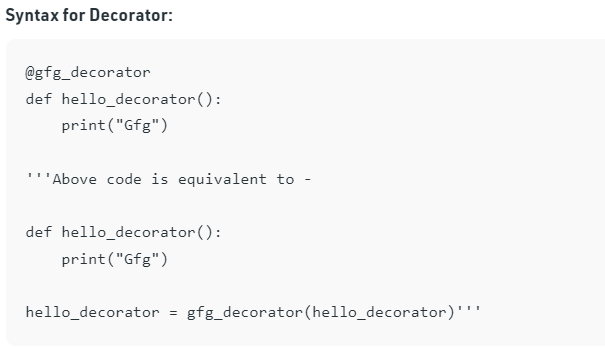
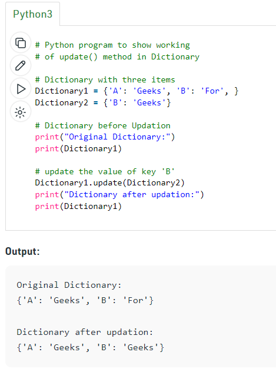
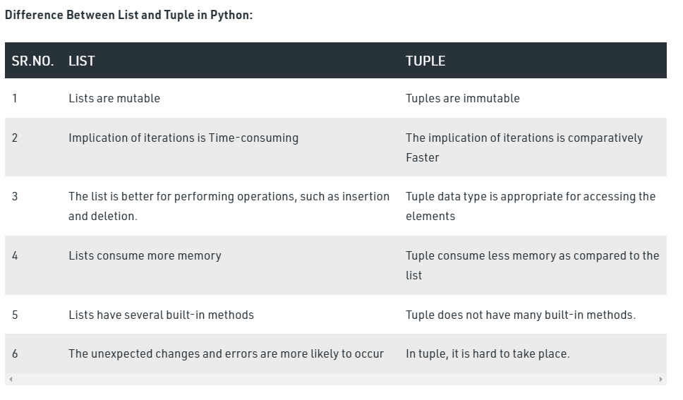
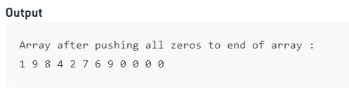
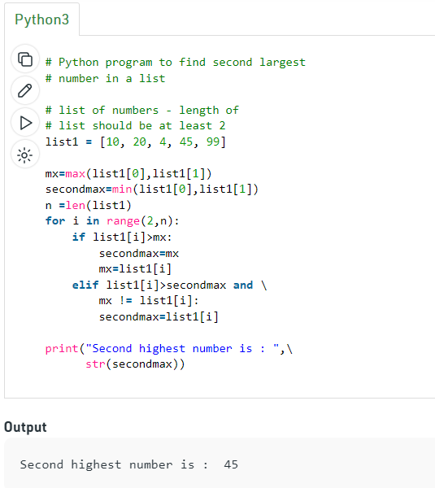
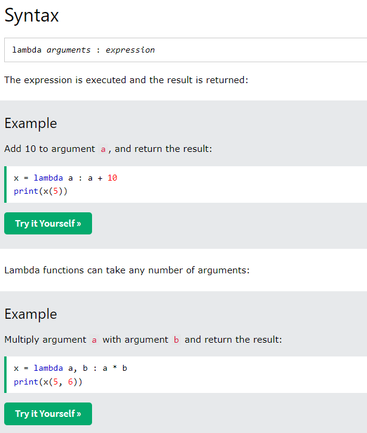
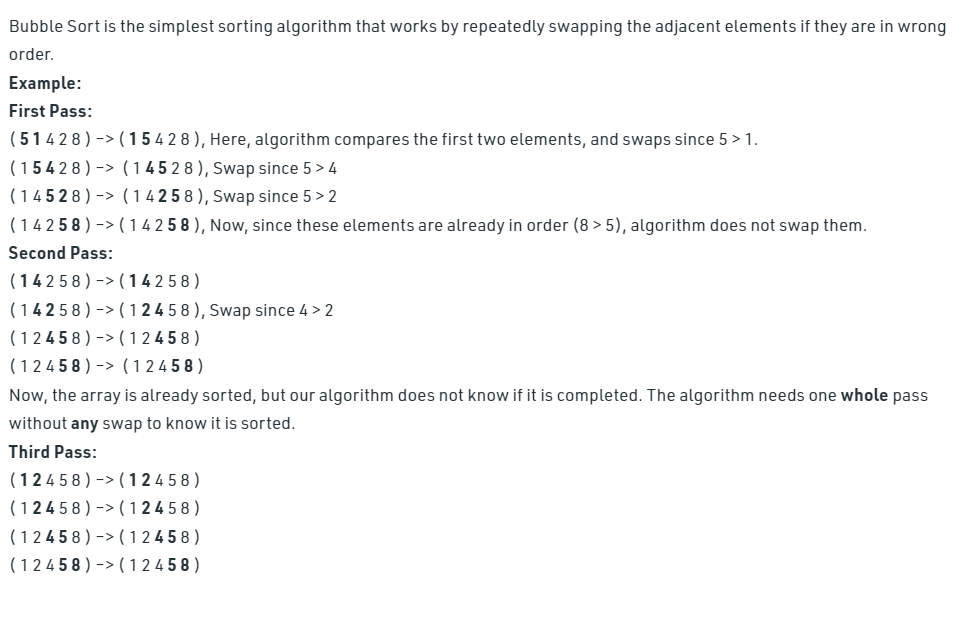
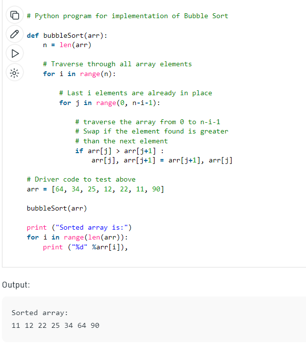

Python:

# Mutable and immutable data types.
     Every variable in python holds an instance of an object. There are two types of objects in python i.e. Mutable and Immutable objects. 
     Whenever an object is instantiated, it is assigned a unique object id. The type of the object is defined at the runtime and it can’t be changed afterwards. 
     However, it’s state can be changed if it is a mutable object. To summarise the difference, mutable objects can change their state or 
     contents and immutable objects can’t change their state or content.

# What are generator examples for generators (print starting date - today's  to 5 days) using generator concepts.
    There are two terms involved when we discuss generators.

    Generator-Function : A generator-function is defined like a normal function, but whenever it needs to generate a value, 
    it does so with the yield keyword rather than return. If the body of a def contains yield, the function automatically becomes a generator function.

    # A generator function that yields 1 for first time,
    # 2 second time and 3 third time
    def simpleGeneratorFun():
        yield 1            
        yield 2            
        yield 3            
    
    # Driver code to check above generator function
    for value in simpleGeneratorFun(): 
        print(value)
    Output :

    1
    2
    3
    Generator-Object : Generator functions return a generator object. Generator objects are used either by calling the next method on
    the generator object or using the generator object in a “for in” loop (as shown in the above program).

    # A Python program to demonstrate use of 
    # generator object with next() 
    
    # A generator function
    def simpleGeneratorFun():
        yield 1
        yield 2
        yield 3
    
    # x is a generator object
    x = simpleGeneratorFun()
    
    # Iterating over the generator object using next
    print(x.next()) # In Python 3, __next__()
    print(x.next())
    print(x.next())
    Output :

    1
    2
    3
    So a generator function returns an generator object that is iterable, 

# Given a dictionary which has multiple values in a key (Note: not in value ), is that possible?
    
    Yes it is possible. we can have alist or tuple as keys 

# what are decorators example for decorators
    A decorator in Python is a function that takes another function as its argument, and returns yet another function .
    The decorators are used to modify the behaviour of function or class. In Decorators, functions are taken as the argument into another function and then called inside the wrapper function.
    

# A function has dict1.update(dict2) (Note: no return keyword inside function), what is the output and how?
    Python Dictionary update() method updates the dictionary with the elements from another dictionary object or from an iterable of key/value pairs.
    There will be no output to display as no return or print statement is used.
    Example:
    

# count the number of words present in the paragraph given below. 
“The horizontal offset of the shadow. A positive value puts the shadow on the right side of the box, a.    negative value puts the shadow on the left side of the box.”
    Code:   

	# Python3 code to demonstrate
	# to count words in string
	# using split()

	# initializing string
	test_string = “The horizontal offset of the shadow. A positive value puts the shadow on the right side of the box, a.   
	negative value puts the shadow on the left side of the box.”

	# printing original string
	print ("The original string is : " + test_string)

	# using split()
	# to count words in string
	res = len(test_string.split())

	# printing result
	print ("The number of words in paragraph are : " + str(res))

# Li = [0,1,0,1,0,1] Count number of 1 in list without using count () method and if- else?

    from collections import Counter
	>>> counter = Counter(x)
	Counter([0,1,0,1,0,1])
	>>> counter.get(1)
	3
	>>> 

# li = [1,2, None,3]? What is the length of the list? and Why?
    
    list1=[1,2, None,3]
    print(len(list1))
    Output:4

# Difference between List and tuple?

    

# Create a directory and search any contact from them
    people = {
    "Austun": 8032654235,
    "Martin": 8032658258}
    print(people.get("Martin", "Not Found"))

# [1,3,0,4,5,0] shift all the zero at the last index 
    # Python3 code to move all zeroes
	# at the end of array

	# Function which pushes all
	# zeros to end of an array.
def pushZerosToEnd(arr, n):
	count = 0 # Count of non-zero elements
	
	# Traverse the array. If element
	# encountered is non-zero, then
	# replace the element at index
	# 'count' with this element
	for i in range(n):
		if arr[i] != 0:
			
			# here count is incremented
			arr[count] = arr[i]
			count+=1
	
	# Now all non-zero elements have been
	# shifted to front and 'count' is set
	# as index of first 0. Make all
	# elements 0 from count to end.
	while count < n:
		arr[count] = 0
		count += 1
		
	# Driver code
arr = [1, 9, 8, 4, 0, 0, 2, 7, 0, 6, 0, 9]
n = len(arr)
pushZerosToEnd(arr, n)
print("Array after pushing all zeros to end of array:")
print(arr)

O/P:

# .find the 2nd highest value from the list
    

# .what is mapping 
    Python's map() is a built-in function that allows you to process and transform all the items in an iterable without using an explicit for loop, a technique commonly known as mapping. map() is useful when you need to apply a transformation function to each item in an iterable and transform them into a new iterable.

# .lambda function 
    A lambda function is a small anonymous function.A lambda function can take any number of arguments, but can only have one expression.
    

# .bubble sort 

Example:

 

