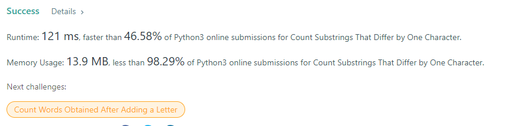
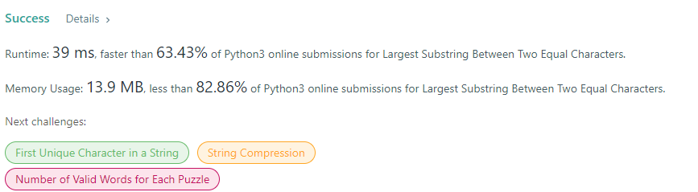
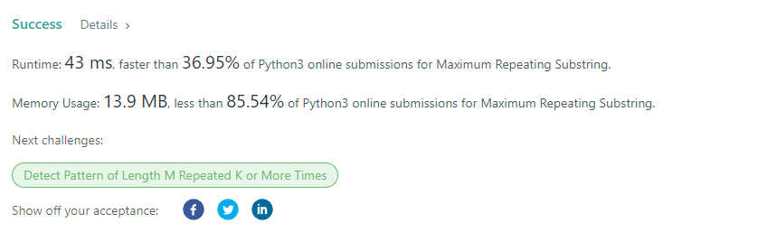
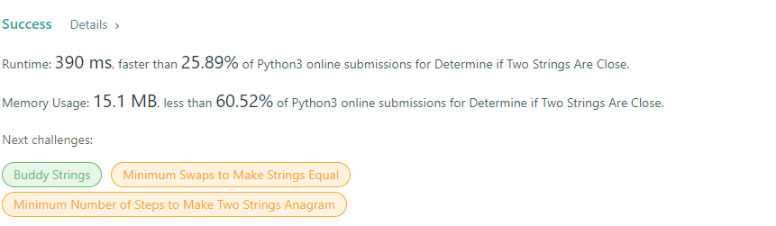

# https://leetcode.com/problems/3sum/
    Code:
    class Solution(object):
        def threeSum(self, nums):
            """
            :type nums: List[int]
            :rtype: List[List[int]]
            """
            nums.sort()
            N, result = len(nums), []
            for i in range(N):
                if i > 0 and nums[i] == nums[i-1]:
                    continue
                target = nums[i]*-1
                s,e = i+1, N-1
                while s<e:
                    if nums[s]+nums[e] == target:
                        result.append([nums[i], nums[s], nums[e]])
                        s = s+1
                        while s<e and nums[s] == nums[s-1]:
                            s = s+1
                    elif nums[s] + nums[e] < target:
                        s = s+1
                    else:
                        e = e-1
            return result

# https://leetcode.com/problems/kth-largest-element-in-an-array/
    Code:
    class Solution(object):
    def findKthLargest(self, nums, k):
        """
        :type nums: List[int]
        :type k: int
        :rtype: int
        """
        heapq.heapify(nums)
        amount = len(nums)
        while amount > k:
            heapq.heappop(nums)
            amount -= 1
        return nums[0]

# https://www.hackerrank.com/challenges/alternating-characters/problem
# https://www.hackerrank.com/challenges/special-palindrome-again/problem
# https://leetcode.com/problems/array-of-doubled-pairs/
# https://leetcode.com/problems/unique-email-addresses/
# https://leetcode.com/problems/reorder-data-in-log-files/

# Week two
# https://leetcode.com/problems/split-two-strings-to-make-palindrome/
    Code:
    class Solution:
    def checkPalindromeFormation(self,a:str,b:str)->bool:
        def middle_is_palindrome(s,l,r):
            while l<r and s[l]==s[r]:
                l+=1
                r-=1
            return l>=r
        def check_initials(a,b):
            l=0;r=len(a)-1
            while l<r and a[l]==b[r]:
                l+=1
                r-=1
            return middle_is_palindrome(a,l,r) or middle_is_palindrome(b,l,r)
        return check_initials(a,b) or check_initials(b,a)
    ScreenShot:

# https://leetcode.com/problems/count-substrings-that-differ-by-one-character/
    Code:
    class Solution:
    def countSubstrings(self, s: str, t: str) -> int:
        ans=0
        for i in range(len(s)):
            for j in range(len(t)):
                x=i
                y=j
                d=0
                while x<len(s) and y<len(t):
                    if s[x]!=t[y]:
                        d+=1;
                    if d==1:
                        ans+=1
                    elif d==2:
                        break;
                    x+=1
                    y+=1
        return ans

     ScreenShot:

# https://leetcode.com/problems/largest-substring-between-two-equal-characters/
    Code:
    class Solution:
    def maxLengthBetweenEqualCharacters(self, s: str) -> int:
        longest = -1
        visited = {}
        for i, c in enumerate(s):
            if c in visited:
                longest = max(longest, i - visited[c] - 1)
            else:
                visited[c] = i
            
        return longest
    Screenshot:

# https://leetcode.com/problems/maximum-repeating-substring/
    code:
    class Solution:
    def maxRepeating(self, sequence: str, word: str) -> int:
        count=0
        while True:
            if word*count not in sequence:
                return count-1
            count+=1
    ScreenShot:

# https://leetcode.com/problems/check-if-two-string-arrays-are-equivalent/
    code:
    class Solution:
    def arrayStringsAreEqual(self, word1: List[str], word2: List[str]) -> bool:
        string1=''.join([str(item) for item in word1])
        string2=''.join([str(item) for item in word2])
        if string1==string2:
            return True
        else:
            return False
    Screenshot:

# https://leetcode.com/problems/determine-if-two-strings-are-close/
    Code:
    class Solution:
    def closeStrings(self, word1: str, word2: str) -> bool:
        if len(word1)!=len(word2):
            return False
        
        set1=set(word1)
        set2=set(word2)
        
        freq1,freq2={},{}
        
        for char in word1:
            freq1[char]=freq1.get(char,0)+1
        
        for char in word2:
            freq2[char]=freq2.get(char,0)+1
        if sorted(freq1.values())==sorted(freq2.values()) and sorted(set1)==sorted(set2):
            return True
        return False
    Screeshot:

# https://leetcode.com/problems/palindrome-partitioning-iv/
# https://leetcode.com/problems/largest-merge-of-two-strings/
# https://leetcode.com/problems/sum-of-beauty-of-all-substrings/
# https://practice.geeksforgeeks.org/problems/maximize-number-of-1s0905/1
# https://practice.geeksforgeeks.org/problems/maximum-value-of-difference-of-a-pair-of-elements-and-their-index/1/
# https://practice.geeksforgeeks.org/problems/maximum-index-1587115620/1
# https://practice.geeksforgeeks.org/problems/stock-buy-and-sell-1587115621/1
# https://practice.geeksforgeeks.org/problems/max-circular-subarray-sum-1587115620/1

